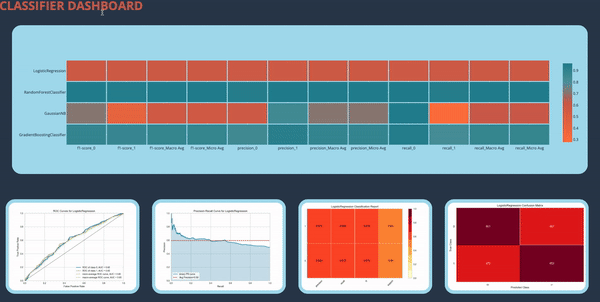

# Classifier Dashboard
## Video Example

### A Dashboard that displays key metrics for evaluating my models.
#
## The Problem this solves:
I was having trouble finding a way to make a binary prediction because my target feature was skewed 97:3, so I made this to compare and choose the best model. It is especially helpful as I work more with the data and need quick visuals.
#
## Highlights
Heatmap: Overall comparision between models that displays each metric.
-  Features a 'hover' function that changes the graphs that are displayed below.

ROC Curve: Plots the true positive rate against the false positive rate
-  Includes the AUC, which indicates how well the model is at separating classes

Precision-Recall Curve: Plots precision vs recall.
-  Good for when you want to optimize one or the other

Classification Report: Displays precision, recall, f1, and the binary support.

Confusion Matrix: Displays the TP, FP, TN, and FN values for the given model.
#
## Lots of help from:
https://github.com/taylorplumer/classifiers-dash

